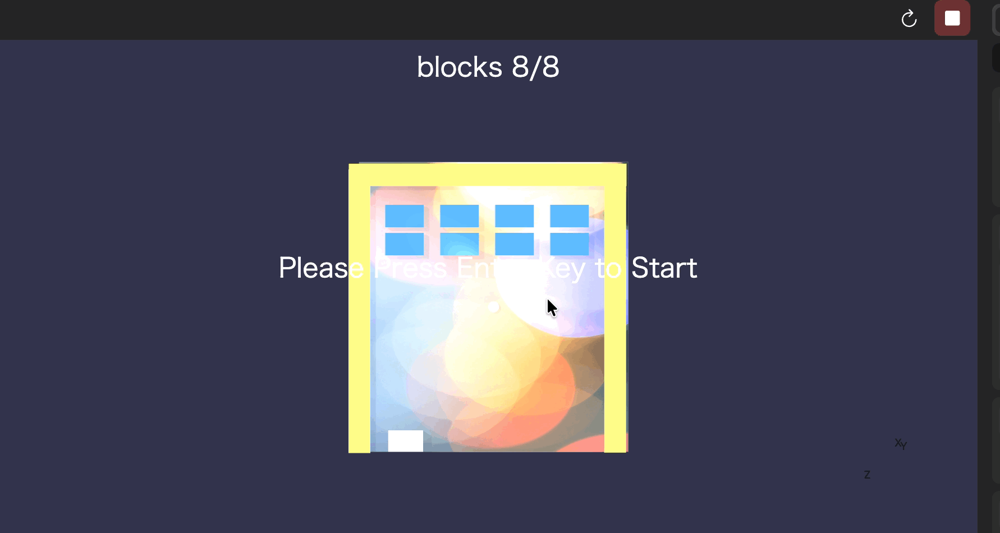

# Ping Pong Game made by Babylon.js Editor Ver 5

## Background

Babylon.js Editor has been further updated as wonderful WebGL contents creating editor.

The repository is an example of Babylon.js Editor project.

Environment : Babylon.js Editor v5.0 or later

## Install Babylon.js Editor

Access the [official website](https://editor.babylonjs.com/) and get files for Windows/Mac/Linux.

## Run the project

Start the editor, File > Open Project, select "project.bjseditor" file.

Press a triangle button below. You can play the ping pong game.

## About the sample game

- Press Enter key -> Press Space key -> Start the game  
- Left or Right key move player block  
- If your ball collides with all blocks. You can clear the game.

## Reference (Japanese Only)

[Babylon.js Editor v5でもう一度ブロック崩しゲームを作ってみる (ステージ作成、操作)](https://www.crossroad-tech.com/entry/pingpong-game-babylonjs-editor-v5_1)  

[Babylon.js Editor v5でもう一度ブロック崩しゲームを作ってみる (弾を飛ばして衝突判定)](https://www.crossroad-tech.com/entry/pingpong-game-babylonjs-editor-v5_2)

[Babylon.js Editor v5でもう一度ブロック崩しゲームを作ってみる (弾とブロックの衝突判定)](	https://www.crossroad-tech.com/entry/pingpong-game-babylonjs-editor-v5_3)

[Babylon.js Editor v5でもう一度ブロック崩しゲームを作ってみる (GUIを追加してスコア表示)](https://www.crossroad-tech.com/entry/pingpong-game-babylonjs-editor-v5_4)

